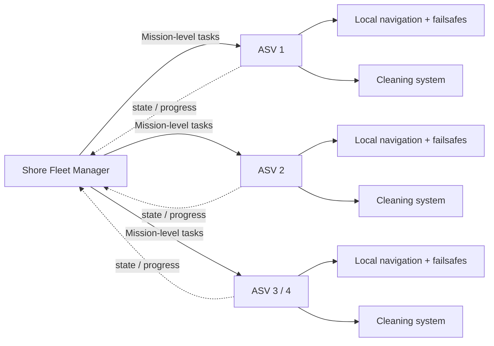

<div align="center">

# Cooperative Autonomous Surface Vehicle Swarm for Nile Surface Cleaning

### Autonomy · Cleaning · Cooperation · Experimental Validation

**October University for Modern Sciences and Arts (MSA University)**  
**Mechatronics Systems Engineering · Final-Year Graduation Project · 2026/2027**

**Aiham Moustafa Awad · Omar Mohamed Bakr**

<br>

[](https://github.com/aihamawd/asv-nile-cleaning-swarm/actions/workflows/ci.yml)


[Project Board](https://github.com/users/aihamawd/projects/1) · [Issues](https://github.com/aihamawd/asv-nile-cleaning-swarm/issues) · [Discussions](https://github.com/aihamawd/asv-nile-cleaning-swarm/discussions) · [Wiki](https://github.com/aihamawd/asv-nile-cleaning-swarm/wiki) · [Pull Requests](https://github.com/aihamawd/asv-nile-cleaning-swarm/pulls)

</div>

---

> **Terminology:** In this project, **ASV means Autonomous Surface Vehicle**. **Vehicle** is the preferred term for each individual ASV throughout the project documentation.

## Project Vision

Design, fabricate, integrate, and experimentally validate a cooperative fleet of **Autonomous Surface Vehicles (ASVs)** for surface cleaning in representative Egyptian Nile environments.

The project continues a previous MSA autonomous water-surface-cleaning robot and extends it toward a common multi-vehicle architecture with improved physical cleaning, environmental-disturbance handling, fault-aware autonomy, and cooperative task allocation.

### At a Glance

| Item | Current baseline |
|---|---|
| **Project window** | 24 Aug 2026 → 20 Jun 2027 |
| **Fleet target** | 3–4 physical ASVs |
| **New build** | 1 newly designed and fabricated ASV |
| **Legacy integration** | 2–3 inherited ASVs, restored/retrofitted where technically feasible |
| **Current gate** | M1 — Requirements & Legacy Vehicle Characterisation |
| **Local autonomy** | Marine autopilot + onboard sensing/failsafes + ROS 2 mission interface |
| **Fleet coordination** | Shore Fleet Manager at mission level only |
| **Engineering record** | GitHub repository + Issues/Project + traceable evidence |

Engineering quality, safety, reliability, measurable performance, and experimental evidence take priority over maximizing vehicle count.

## Core System Goals

- Autonomous marine navigation using GNSS/IMU and a marine autopilot.
- ROS 2-based high-level mission execution and system integration.
- Floating-waste collection.
- Physical water-hyacinth cutting, handling, capture, and retention.
- Anti-entanglement and jam-aware mechanical/electrical design.
- Environmental-current and disturbance evaluation.
- Cooperative mission-level task allocation and reassignment.
- Fault-aware behaviour and recovery of unfinished work.
- Health, power, load, and communication-state monitoring.
- Repeatable experimental validation with traceable evidence.
- Progressive testing from subsystem level to representative field conditions.

## System Architecture

The system separates **local ASV autonomy** from **fleet-level mission coordination**.



### Onboard Each ASV

- GNSS/IMU state estimation.
- Heading and speed control.
- Differential propulsion.
- Geofencing.
- Hold / RTL.
- Local failsafes.
- RC/manual override.
- Health and power monitoring.
- ROS 2 mission client.
- Cleaning-system control and instrumentation.

### Shore Fleet Manager

- Mission planning.
- Cleaning-area decomposition.
- Shared task pool.
- ASV-state monitoring.
- Task assignment and reassignment.
- Mission-progress tracking.
- Fleet-level logging.

The Fleet Manager issues **mission-level tasks only**. It does not continuously command motors or replace onboard safety and autonomy.

## Fleet Baseline

The current engineering baseline targets **3–4 physical ASVs**:

- **1 new ASV** designed and fabricated during this project.
- **2–3 inherited/legacy ASVs** assessed, restored where feasible, and retrofitted to a common cooperative fleet interface.

Additional ASVs are integrated only when they contribute meaningful fleet-level functionality or experimental evidence.

## Team & Responsibility Split

Subsystem ownership is explicit, while integration, fleet autonomy, testing, and final validation remain shared.

| Owner | Primary responsibility |
|---|---|
| **Aiham Moustafa Awad** | Electrical architecture, power/protection, embedded systems, sensors/instrumentation, marine autopilot, navigation/control, propulsion control, cutter electrical integration, simulation and system integration |
| **Omar Mohamed Bakr** | Hull/structure, hydrostatics and stability, CAD, collection system, water-hyacinth mechanical system, anti-entanglement design, propulsion mechanical integration, fabrication and mechanical testing |
| **Shared** | ROS 2, Fleet Manager, cooperative allocation, perception integration, requirements, safety, procurement, system integration, experiments, validation, engineering documentation and final delivery |

### Aiham — Electrical, Control & Integration Lead

Primary ownership includes:

- Legacy electrical/control/software baseline assessment.
- Main DC architecture, battery/BMS, fusing, isolation, DC-DC conversion and monitoring.
- Sensors, instrumentation, leak/load/current sensing and embedded interfaces.
- ArduPilot Rover/Boat integration, GNSS/IMU, differential thrust, failsafes and controller tuning.
- Cutter motor-drive support, current sensing, overload/jam protection and electrical interlocks.
- SITL, ROS 2/Gazebo integration support, telemetry/logging and system-level debugging.

### Omar — Mechanical, Collection & Fabrication Lead

Primary ownership includes:

- Legacy mechanical/CAD and hull-integrity assessment.
- Hull/frame design, materials, buoyancy, displacement, freeboard, CG, trim and stability.
- Floating-waste collection geometry, retention and payload accommodation.
- Water-hyacinth cutter/feed/guide architecture, guards, anti-entanglement features and biomass retention.
- Propulsion mounting, propeller protection, anti-fouling geometry and structural hard points.
- Manufacturing drawings, fabrication coordination, mechanical assembly and physical mechanical testing.

Final cutter topology remains evidence-driven and is frozen only after calculations and prototype testing.

### Shared Engineering Work

Both students jointly own:

- ROS 2 integration and common interfaces.
- Mission state machine and fleet client.
- Shore Fleet Manager and shared task lifecycle.
- Communication heartbeat, stale-state handling and communication-loss behaviour.
- Cooperative task allocation and unfinished-work recovery.
- Perception integration where justified by requirements/testing.
- Mechanical/electrical/software interface definition.
- Bench, float, propulsion, autonomy, cleaning, disturbance, multi-ASV and field validation.
- Requirements, design reviews, BOM, procurement, risk, safety, experiment planning, evidence, report, poster, presentation and viva.

## Engineering Operating Model

The current operating system is defined in [`docs/project-management/OPERATING_ARCHITECTURE.md`](docs/project-management/OPERATING_ARCHITECTURE.md). It keeps GitHub as the operational source of truth, Cloud Drive as the heavy/raw evidence vault, and AI/MCP as the administrative layer.

### GitHub = Engineering Source of Truth

This repository is the project's authoritative engineering record and primary storage location. It is intended to preserve the documentation, source code, native engineering files, experimental evidence, procurement records, and project history required to reproduce, audit, continue, and defend the project.

Large binary engineering files that are important to reproducibility or evidence are tracked with **Git LFS**. Regenerable caches, build outputs, temporary simulation files, and duplicate exports should not be committed unnecessarily.

> **Preserve the engineering artifact, evidence, inputs, configurations, and relevant outputs. Exclude only files that can be regenerated without loss of engineering information.**

### Digital Thread

Significant engineering work should remain traceable through permanent project IDs:

`REQ` · `SYS` · `ADR` · `MECH` · `ELEC` · `EMB` · `SW` · `NAV` · `VIS` · `FLT` · `PUR` · `BOM` · `SUP` · `EXP` · `TEST` · `FAIL` · `RCA` · `CHG` · `RISK` · `SAFE` · `MIN` · `WEEK` · `EVD`

The intended flow is:

```text
Requirement
    ↓
Design / Architecture Decision
    ↓
Implementation
    ↓
Experiment / Verification
    ↓
Evidence
    ↓
Engineering Conclusion
```

### Safety Boundary

Repository approval, merged software, or a passing CI check **does not authorize physical operation**.

Irreversible fabrication, energized hardware testing, propulsion/cutter operation, field deployment, and purchase commitments require explicit human approval under the project governance process. A software stop is not treated as a substitute for a hardware emergency-stop or physical isolation mechanism.

See [`GOVERNANCE.md`](GOVERNANCE.md), [`SECURITY.md`](SECURITY.md), [`CONTRIBUTING.md`](CONTRIBUTING.md), and [`EVIDENCE_POLICY.md`](EVIDENCE_POLICY.md).

## Engineering Principles

1. **Engineering quality before vehicle quantity.**
2. **Evidence before design freeze.**
3. **Maximum engineering time, minimum administrative burden.**
4. **Reuse proven work before rebuilding it.**
5. **No engineering claim without traceable evidence.**
6. **No major hardware purchase without a requirement or calculation basis.**
7. **Local safety remains onboard each ASV.**
8. **Fleet communication loss must not remove local autonomy.**
9. **Physical testing takes priority over simulation-only claims.**
10. **Failures are engineering evidence and must be recorded, not hidden.**

## Repository Layout

Current top-level repository structure:

```text
├── .github/                 # Issue/PR templates, CODEOWNERS, CI, Dependabot
├── docs/                    # Requirements, architecture, PM and engineering records
├── experiments/             # Experimental work and evidence-linked results
├── firmware/                # Embedded firmware
├── hardware/                # Mechanical/electrical/interface/BOM engineering
├── navigation/              # Navigation and control work
├── project-data/            # Traceability, cost, risk and evidence registers
├── ros2_ws/                 # ROS 2 workspace
├── simulation/              # Simulation assets and configurations
│
├── README.md
├── GOVERNANCE.md
├── CONTRIBUTING.md
├── EVIDENCE_POLICY.md
└── SECURITY.md
```

## Project Milestones

| ID | Milestone |
|---|---|
| **M1** | Requirements & Legacy Vehicle Characterisation |
| **M2** | Fleet Mechanical Readiness |
| **M3** | Electrical & Propulsion Integration |
| **M4** | Single-ASV Autonomous Navigation |
| **M5** | Cleaning / Water-Hyacinth Handling Prototype |
| **M6** | Multi-ASV Communication |
| **M7** | Cooperative Task Allocation |
| **M8** | Fault-Aware Reallocation Behaviour |
| **M9** | Controlled Experimental Validation |
| **M10** | Representative Nile-Environment Validation |
| **M11** | Final Engineering Book, Report, Poster & Viva |

The live schedule, assignments, dependencies, status, and date fields are maintained in the [GitHub Project](https://github.com/users/aihamawd/projects/1).

## Validation Philosophy

Development progresses through controlled engineering gates:

```text
Bench
  ↓
Subsystem Test
  ↓
Controlled Float / Propulsion
  ↓
Single-ASV Autonomous Operation
  ↓
Cleaning / Hyacinth Handling
  ↓
Multi-ASV Communication
  ↓
Cooperative Task Allocation
  ↓
Fault / Reallocation Testing
  ↓
Representative Field Validation
```

Large fleet demonstrations do not substitute for subsystem reliability or quantitative experimental evidence.

## Working With the Repository

1. Read [`GOVERNANCE.md`](GOVERNANCE.md).
2. Read [`CONTRIBUTING.md`](CONTRIBUTING.md).
3. Read [`EVIDENCE_POLICY.md`](EVIDENCE_POLICY.md).
4. Read [`SECURITY.md`](SECURITY.md).
5. Check the [Current Project Queue](https://github.com/users/aihamawd/projects/1).
6. Use the appropriate GitHub Issue template for new engineering work.
7. Link implementation, experiments, failures, changes, and evidence to the relevant issue/ID.
8. Use pull requests for meaningful repository changes and preserve the requirement-to-evidence digital thread.

## Project Spaces

- **[GitHub Project](https://github.com/users/aihamawd/projects/1)** — execution, dates, assignments and Roadmap.
- **[Issues](https://github.com/aihamawd/asv-nile-cleaning-swarm/issues)** — committed engineering work.
- **[Discussions](https://github.com/aihamawd/asv-nile-cleaning-swarm/discussions)** — questions, design thinking and team discussion.
- **[Wiki](https://github.com/aihamawd/asv-nile-cleaning-swarm/wiki)** — navigable project knowledge base.
- **[Pull Requests](https://github.com/aihamawd/asv-nile-cleaning-swarm/pulls)** — reviewed repository changes.
- **[Documentation](docs/)** — engineering documentation.
- **[Project Data](project-data/)** — traceability and management registers.

## Supervision

**Main Supervisor**  
Assoc. Prof. Dr. Amgad M. Bayoumy Aly

**Co-Supervisor**  
Prof. Dr. Mostafa Zaki

Major scope, budget, safety, architecture, and field-testing changes are subject to supervisor review.

---

<div align="center">

**Cooperative Autonomous Surface Vehicle Swarm for Nile Surface Cleaning**

*Build · Measure · Validate · Cooperate*

**Last updated:** 2026-09-08

</div>
