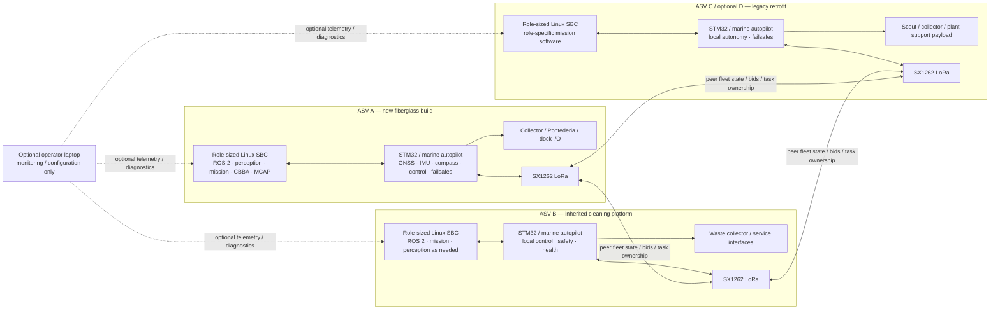

# Cooperative Autonomous Surface Vehicle Swarm for Nile Surface Cleaning

### Autonomous navigation · Physical cleaning · Decentralized cooperation · Evidence-driven validation

**October University for Modern Sciences and Arts (MSA University)**  
**Mechatronics Systems Engineering · Final-Year Graduation Project · 2026/2027**

**Aiham Moustafa Awad · Omar Mohamed Bakr**

[Project Board](https://github.com/users/aihamawd/projects/1) · [Issues](https://github.com/aihamawd/asv-nile-cleaning-swarm/issues) · [Pull Requests](https://github.com/aihamawd/asv-nile-cleaning-swarm/pulls)

---

## Current project baseline — 28 September 2026

The project targets a **mixed physical fleet of 3–4 ASVs**:

- **Robot A:** one new fiberglass ASV designed and fabricated from scratch.
- **Robot B:** inherited 2025/2026 MSA cleaning ASV, restored and measured before modification.
- **Robot C:** repurposed legacy platform selected after condition/capability audit.
- **Robot D:** optional fourth legacy platform only if technically viable and useful.

The fleet is intentionally **heterogeneous**. Vehicles do not need identical hulls, propulsion, compute, sensors or payloads. They share a minimum mission, health, navigation and communication contract.

### Current engineering position

**Architecture freeze + pre-build engineering.** Immediate priorities are:

1. finish legacy fleet inventory and measured baseline;
2. solve Robot A hydrostatics, displacement, CG/CB, trim, payload and fiberglass structure;
3. size propulsion from required loaded speed/current performance and bench thrust-current data;
4. bench-test floating-waste collection and Pontederia handling/cutter concepts before freezing mechanisms;
5. freeze the low-level control-stack decision (ArduPilot Boat/Pixhawk-class vs custom STM32; PX4 only if justified);
6. implement the Pi ↔ STM32 interface and STM32 ↔ SX1262 peer-radio path;
7. establish first MSS and VRX/Gazebo current/wind simulation baselines;
8. prepare the FloW image-only YOLO perception pipeline without creating a new training dataset.

## System architecture

```mermaid
flowchart LR
    HMI["Optional operator laptop\nmonitoring / configuration only"]

    subgraph A["ASV A — new fiberglass build"]
        A_PI["Role-sized Linux SBC\nROS 2 · perception · mission · CBBA · MCAP"]
        A_STM["STM32 / marine autopilot\nGNSS · IMU · compass · control · failsafes"]
        A_PAY["Collector / Pontederia / dock I/O"]
        A_RF["SX1262 LoRa"]
        A_PI <--> A_STM
        A_STM --> A_PAY
        A_STM <--> A_RF
    end

    subgraph B["ASV B — inherited cleaning platform"]
        B_PI["Role-sized Linux SBC\nROS 2 · mission · perception as needed"]
        B_STM["STM32 / marine autopilot\nlocal control · safety · health"]
        B_PAY["Waste collector / service interfaces"]
        B_RF["SX1262 LoRa"]
        B_PI <--> B_STM
        B_STM --> B_PAY
        B_STM <--> B_RF
    end

    subgraph C["ASV C / optional D — legacy retrofit"]
        C_PI["Role-sized Linux SBC\nrole-specific mission software"]
        C_STM["STM32 / marine autopilot\nlocal autonomy · failsafes"]
        C_PAY["Scout / collector / plant-support payload"]
        C_RF["SX1262 LoRa"]
        C_PI <--> C_STM
        C_STM --> C_PAY
        C_STM <--> C_RF
    end

    A_RF <--> |"peer fleet state / bids / task ownership"| B_RF
    B_RF <--> |"peer fleet state / bids / task ownership"| C_RF
    C_RF <--> |"peer fleet state / bids / task ownership"| A_RF

    HMI -. "optional telemetry / diagnostics" .-> A_PI
    HMI -. "optional telemetry / diagnostics" .-> B_PI
    HMI -. "optional telemetry / diagnostics" .-> C_PI
```

The architecture is **decentralized by baseline**. There is no mandatory shore computer and no permanent fleet master. Each ASV maintains local autonomy and a replicated fleet/mission view.

## Per operational ASV

### High-level computer

A role-sized Linux SBC handles:

- ROS 2 Jazzy;
- FloW-trained YOLO camera perception where needed;
- mission state machine;
- local map and coverage logic;
- decentralized fleet agent and CBBA task bidding;
- advisory ML/AI functions only after deterministic baselines;
- rosbag2/MCAP logging;
- optional Wi-Fi maintenance and data offload.

A Raspberry Pi family board is one option; no specific Pi generation is mandatory.

### Low-level real-time controller

The STM32/autopilot-class layer handles:

- GNSS + IMU + external compass state estimation;
- heading, speed and differential-thrust control;
- geofence, Hold/RTL/return and stale-command failsafes;
- RC/manual override and physical isolation path;
- collector/cutter/dock auxiliary I/O and hard interlocks;
- current, leak, load/fill and jam sensing;
- direct **SX1262 LoRa transceiver over SPI** for compact peer status/task traffic.

There is **no ESP32 requirement** in the baseline.

## Decentralized fleet

The baseline fleet logic includes:

- robot identity and capability vector;
- heartbeat and health state;
- pose, heading, speed and short intent;
- battery reserve and payload/full state;
- CBBA-style capability/energy/load-aware task bids;
- task ownership leases and stale-owner reconciliation;
- temporary leadership only when useful for a coalition or dock queue;
- unfinished-work recovery after bounded timeout/withdrawal;
- distributed dock token and staging waypoints.

An operator laptop may monitor and configure the fleet, but loss of that laptop is not a fleet-control failure.

## Mission payloads

### Floating waste collection

Robot B provides the inherited passive-net baseline. Candidate improvements include bow guides/funnel geometry, powered feed/conveyor where justified, retention/backflow control, fill/load estimation and a compatible unloading interface.

### Water hyacinth

Use the accepted name **water hyacinth (*Pontederia crassipes*; syn. *Eichhornia crassipes*)**.

The project prioritizes **intact mechanical removal where practical**. Cutting is assistance for dense mats, not the default goal. Candidate cutter/feed systems are selected from measured feedability, entanglement, cutting force, motor current, fragment escape, maintainability and safety.

No herbicide application is part of the ASV baseline.

### Docking and unloading

Docking is a first-class subsystem:

GNSS/compass coarse approach → AprilTag/ArUco relative alignment → ToF final range → guide rails/mechanical stop → contact/latch confirmation → unloading → optional guarded charging → token release.

## Perception

- **RGB camera + FloW image dataset + YOLO** is the floating-waste baseline.
- The project will **reuse FloW** rather than create a new training dataset.
- **2D LiDAR** is conditional and role-specific for obstacle/dock geometry.
- **ToF** is intended for close-range docking/clearance and must be characterized over water/sunlight.
- **Radar is not in the current baseline.**

## Modelling, simulation and current/disturbance work

The engineering chain is deliberately multi-model:

- **SolidWorks / Motion:** hull, structure, mechanisms, mass properties, interference.
- **ANSYS Fluent:** resistance/drag, current-direction and draft/payload cases.
- **MATLAB/Simulink + Marine Systems Simulator (MSS):** 3-DOF marine dynamics, guidance/control reference, disturbance observer and energy models.
- **ROS 2 Jazzy + Gazebo Harmonic + VRX:** 3–4 ASV mission environment, dock, obstacles, current, wind, waves and fleet faults.
- **ArduPilot SITL / Mission Planner:** candidate low-level marine autopilot workflow and mode/failsafe testing where selected.
- **Foxglove / PlotJuggler / MCAP:** synchronized evidence and replay.
- **Wireshark / Serial Studio / PulseView:** network, UART and bus diagnostics.

Simulation does not replace water testing. MSS/VRX/Fluent results are calibrated or bounded with measured thrust, mass, speed, turning and field telemetry.

## AI/ML policy

No LLM or generative model is in the safety-critical control loop.

Deterministic control, interlocks, geofence, RC override and communication-loss behavior remain authoritative. Candidate advisory ML functions are tested only against deterministic baselines:

1. jam/prop-fouling detection;
2. remaining-energy prediction;
3. real-world dynamics residual learning;
4. hotspot prediction;
5. learned allocation comparison;
6. health/fault scoring;
7. debris-drift/intercept prediction;
8. docking anomaly assistance;
9. optional water-quality outlier detection if sensors exist.

A model is allowed to influence mission logic only if measured benefit justifies it.

## Hardware-selection philosophy

The project is **reuse-first, role-specific and evidence-driven**.

Serviceable legacy hardware should be reused where it meets the engineering requirement. More capable compute or sensing is concentrated on vehicles that actually need it. Hardware is frozen from measured mission requirements, interface compatibility, reliability and test evidence rather than by defaulting every vehicle to the same configuration.

## Repository execution model

GitHub Issues are executable work. Parent issues are milestone gates; sub-issues are engineering tasks. GitHub is the operational source of truth; large/raw evidence may live in the configured evidence vault but must be indexed here.

See:

- [Current execution queue](docs/project-management/CURRENT_EXECUTION_QUEUE.md)
- [Master execution plan](docs/project-management/MASTER_EXECUTION_PLAN.md)
- [Gantt](docs/project-management/GANTT.md)
- [System architecture](docs/architecture/SYS-001_system-architecture.md)
- [Requirements baseline](docs/requirements/REQ-BASELINE.md)
- [Operating architecture](docs/project-management/OPERATING_ARCHITECTURE.md)

## Milestone gates

| ID | Milestone |
|---|---|
| M1 | Requirements & Legacy Fleet Characterisation |
| M2 | Mechanical, Hull & Payload Readiness |
| M3 | Power, Propulsion & Embedded Electrical Integration |
| M4 | Single-ASV Autonomy, Perception & Simulation |
| M5 | Collection, Pontederia Handling & Dock Prototype |
| M6 | Peer Communication & Common Fleet State |
| M7 | Decentralized Coverage, CBBA & Cooperation |
| M8 | Fault-Aware Reallocation, Docking & Service |
| M9 | Controlled Experimental Validation & AI/ML Ablation |
| M10 | Representative Nile-Environment Validation |
| M11 | Engineering Book, Report, Poster, Viva & Release |

## Team split

- **Aiham:** electrical, power/protection, embedded, compute, custom PCB, navigation/control, propulsion electrical, sensing, communication, simulation/control integration.
- **Omar:** mechanical, hull/fiberglass/structure, hydrostatics/stability, collection, Pontederia mechanics, cutter/feed, dock mechanics, fabrication.
- **Both:** requirements, ROS 2 interfaces, decentralized fleet software, perception integration, validation, evidence and final academic delivery.

## Safety boundary

Repository changes, CI, simulation and code review do **not** authorize physical actuation. Fabrication, flashing/energizing hardware, propulsion/cutter testing and river deployment require explicit human supervision/approval.

---

**Last architecture rebaseline:** 2026-09-28
