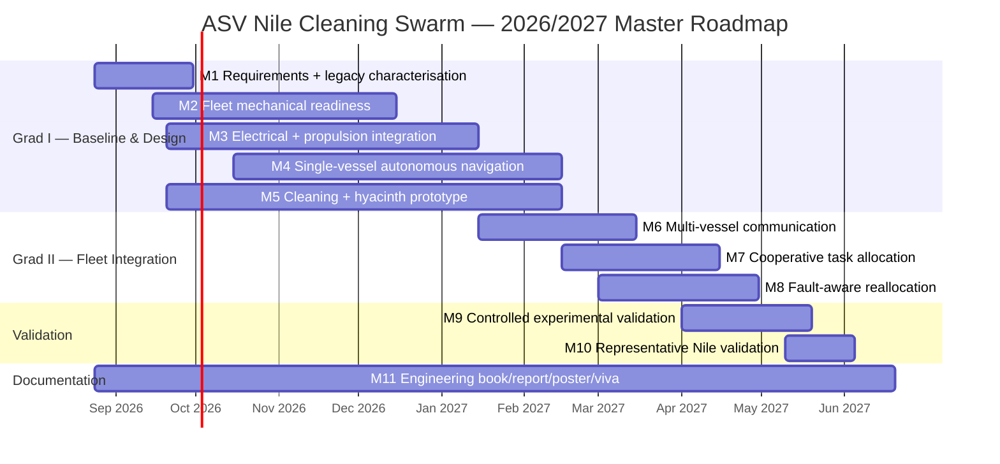
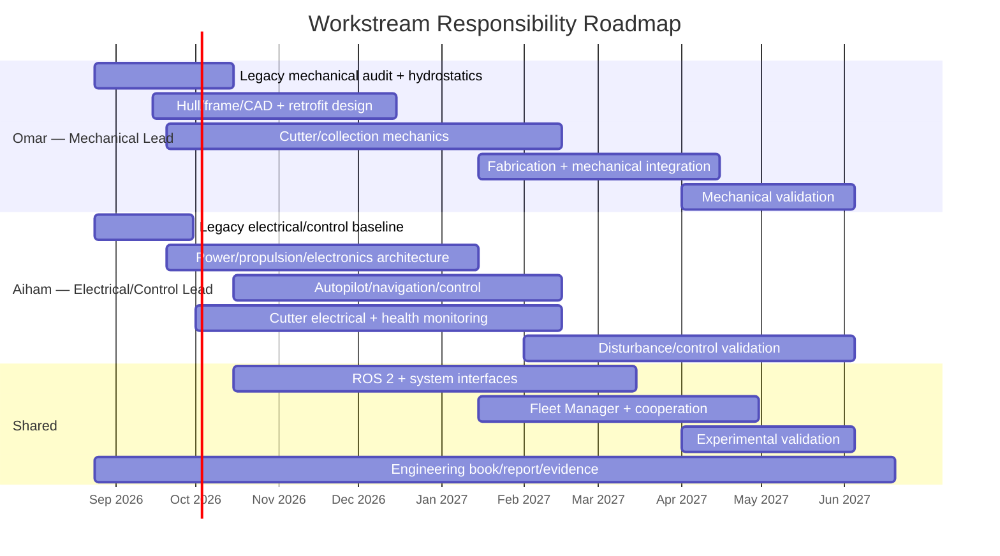

# Project Gantt

The roadmap below is the schedule baseline. Dates are planning targets and are re-baselined only with a documented engineering reason; historical dates are not silently rewritten.

## Milestone roadmap

## Responsibility roadmap

## Schedule control

- Dates are targets, not substitutes for technical gate evidence.
- M10 cannot begin field activity without site/safety/permission readiness.
- Physical fleet quantity may be reduced if a legacy vessel is not technically viable; the decision must be documented rather than hidden.
- A milestone may overlap another when the dependency required for a specific subtask is already satisfied.
