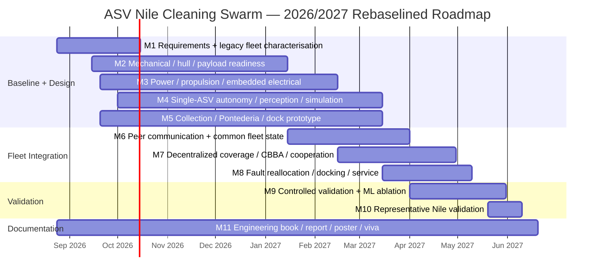
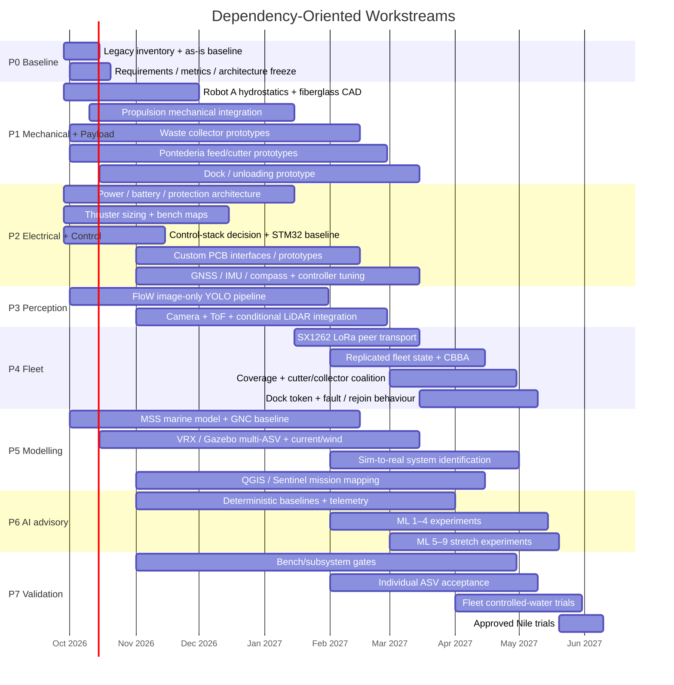

# Project Gantt — Rebaseline 2026-09-28

Dates are planning targets. This rebaseline reflects the 3–4 heterogeneous-ASV architecture, decentralized LoRa/CBBA fleet, Robot A fiberglass build, dock/unloading subsystem, FloW vision, MSS/VRX current modelling, custom PCB intent and performance-based procurement.

## Milestone roadmap

```mermaid
gantt
    title ASV Nile Cleaning Swarm — 2026/2027 Rebaselined Roadmap
    dateFormat  YYYY-MM-DD
    axisFormat  %b %Y

    section Baseline + Design
    M1 Requirements + legacy fleet characterisation  :m1, 2026-08-24, 2026-10-15
    M2 Mechanical / hull / payload readiness          :m2, 2026-09-15, 2027-01-15
    M3 Power / propulsion / embedded electrical       :m3, 2026-09-20, 2027-02-15
    M4 Single-ASV autonomy / perception / simulation  :m4, 2026-10-01, 2027-03-15
    M5 Collection / Pontederia / dock prototype       :m5, 2026-09-20, 2027-03-15

    section Fleet Integration
    M6 Peer communication + common fleet state        :m6, 2027-01-15, 2027-04-01
    M7 Decentralized coverage / CBBA / cooperation    :m7, 2027-02-15, 2027-04-30
    M8 Fault reallocation / docking / service         :m8, 2027-03-15, 2027-05-10

    section Validation
    M9 Controlled validation + ML ablation            :m9, 2027-04-01, 2027-05-31
    M10 Representative Nile validation                :m10, 2027-05-20, 2027-06-10

    section Documentation
    M11 Engineering book / report / poster / viva     :m11, 2026-08-24, 2027-06-20
```

## Detailed workstream roadmap

```mermaid
gantt
    title Dependency-Oriented Workstreams
    dateFormat YYYY-MM-DD
    axisFormat %b %Y

    section P0 Baseline
    Legacy inventory + as-is baseline                 :2026-09-28, 2026-10-15
    Requirements / metrics / architecture freeze      :2026-10-01, 2026-10-20

    section P1 Mechanical + Payload
    Robot A hydrostatics + fiberglass CAD             :2026-09-28, 2026-12-01
    Propulsion mechanical integration                  :2026-10-10, 2027-01-15
    Waste collector prototypes                         :2026-10-01, 2027-02-15
    Pontederia feed/cutter prototypes                  :2026-10-01, 2027-02-28
    Dock / unloading prototype                         :2026-10-15, 2027-03-15

    section P2 Electrical + Control
    Power / battery / protection architecture         :2026-09-28, 2027-01-15
    Thruster sizing + bench maps                       :2026-09-28, 2026-12-15
    Control-stack decision + STM32 baseline            :2026-09-28, 2026-11-15
    Custom PCB interfaces / prototypes                 :2026-11-01, 2027-02-15
    GNSS / IMU / compass + controller tuning           :2026-11-01, 2027-03-15

    section P3 Perception
    FloW image-only YOLO pipeline                      :2026-10-01, 2027-01-31
    Camera + ToF + conditional LiDAR integration       :2026-11-01, 2027-02-28

    section P4 Fleet
    SX1262 LoRa peer transport                         :2027-01-15, 2027-03-15
    Replicated fleet state + CBBA                      :2027-02-01, 2027-04-15
    Coverage + cutter/collector coalition              :2027-03-01, 2027-04-30
    Dock token + fault / rejoin behaviour              :2027-03-15, 2027-05-10

    section P5 Modelling
    MSS marine model + GNC baseline                    :2026-10-01, 2027-02-15
    VRX / Gazebo multi-ASV + current/wind              :2026-10-15, 2027-03-15
    Sim-to-real system identification                  :2027-02-01, 2027-05-01
    QGIS / Sentinel mission mapping                    :2026-11-01, 2027-04-15

    section P6 AI advisory
    Deterministic baselines + telemetry                :2026-11-01, 2027-04-01
    ML 1–4 experiments                                 :2027-02-01, 2027-05-15
    ML 5–9 stretch experiments                         :2027-03-01, 2027-05-20

    section P7 Validation
    Bench/subsystem gates                              :2026-11-01, 2027-04-30
    Individual ASV acceptance                          :2027-02-01, 2027-05-10
    Fleet controlled-water trials                      :2027-04-01, 2027-05-31
    Approved Nile trials                               :2027-05-20, 2027-06-10
```

## Responsibility roadmap

- **Aiham:** electrical/power, propulsion sizing/control, STM32/PCB, navigation, sensing/compute, LoRa, MSS/VRX/control integration.
- **Omar:** fiberglass hull, hydrostatics/stability, mechanical propulsion integration, collector, Pontederia mechanism, dock mechanics/fabrication.
- **Both:** ROS 2, FloW integration, decentralized fleet logic, testing, procurement decisions, evidence and final academic delivery.

## Schedule-control rules

- M1 historical start is preserved; target is rebaselined to 15 Oct because the measured legacy baseline is not yet closed.
- Physical fabrication/purchases are gated by evidence, not date pressure.
- M10 requires site/safety/permission readiness.
- Robot D remains optional.
- Downstream work may start early only when its dependency is actually satisfied.
